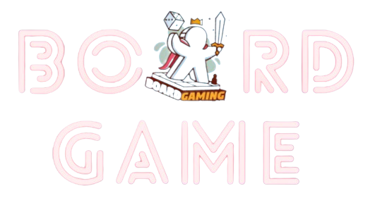

# RECOMMENDATION SYSTEM FULLSTACK PROJECT

## I. Introduce

### 1. The goals of project
Study and Develope the realife project with recommendation system topic throught integrate continous pipeline. Moreover, its Application and deploy into the society and helpful life people.   

### 2. Data Sources
Datasets are taken from link > https://www.kaggle.com/datasets/jvanelteren/boardgamegeek-reviews/
But `Boardgame Reviewer` datasets are originally extracted by `BoardgameGeek` website. - one of the popular games' information website around the world.

> **BoardgameGeek:**
>
Link website: https://boardgamegeek.com/
